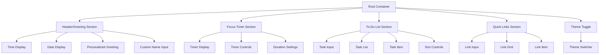
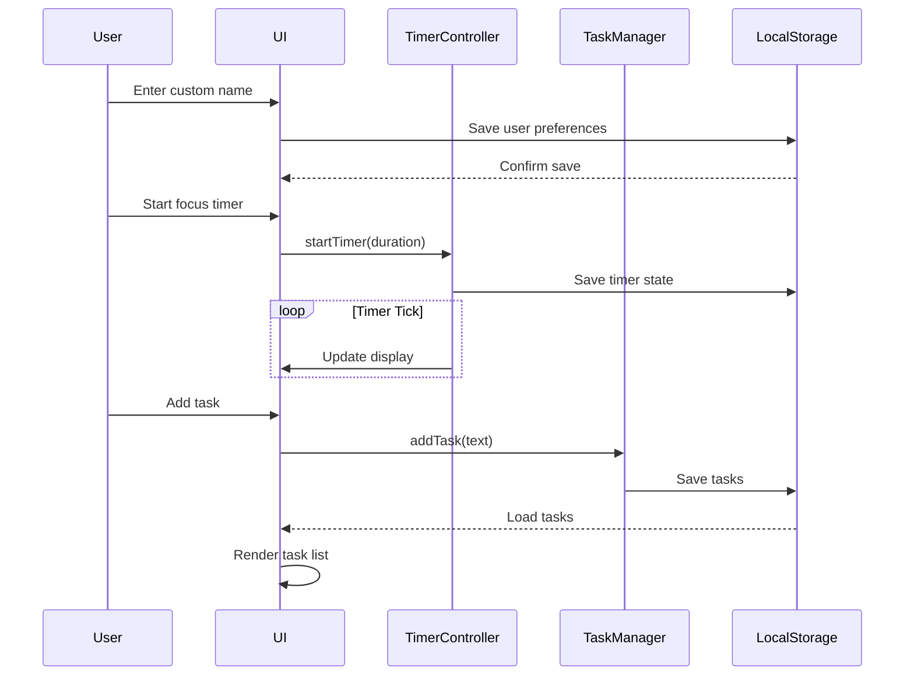

# Design Document: Todo List Life Dashboard

## Overview

A personal productivity dashboard that helps users organize their day with a clean, minimal interface. The application displays real-time clock information, provides a focus timer using the Pomodoro technique, manages a to-do list with CRUD operations, and stores quick links to favorite websites. All data persists locally using the browser's Local Storage API, requiring no backend server.

## Architecture

The application follows a client-side, single-page architecture with three main layers:

- **Presentation Layer**: HTML structure with CSS styling for responsive, accessible UI
- **Logic Layer**: Vanilla JavaScript modules for time management, task CRUD operations, and state persistence
- **Storage Layer**: Local Storage API for persistent data storage across sessions

## Components and Interfaces



### Core Interfaces/Types

```javascript
// User preferences and settings
interface UserSettings {
    theme: 'light' | 'dark';
    customName: string;
    pomodoroDuration: number; // minutes
}

// To-do task structure
interface Task {
    id: string;
    text: string;
    completed: boolean;
    createdAt: number; // timestamp
    sortOrder: number;
}

// Quick link structure
interface QuickLink {
    id: string;
    title: string;
    url: string;
    icon?: string;
}

// Timer state
interface TimerState {
    remainingSeconds: number;
    isRunning: boolean;
    lastUpdated: number;
}
```

## Data Models

The application uses five key data structures stored in Local Storage:

### User Settings

Stores theme preference, custom name, and Pomodoro duration.

```javascript
interface UserSettings {
    theme: 'light' | 'dark';
    customName: string;
    pomodoroDuration: number; // minutes
}
```

### Tasks

Array of task objects with id, text, completed status, createdAt, and sortOrder.

```javascript
interface Task {
    id: string;
    text: string;
    completed: boolean;
    createdAt: number; // timestamp
    sortOrder: number;
}
```

### Quick Links

Array of link objects with id, title, url, and optional icon.

```javascript
interface QuickLink {
    id: string;
    title: string;
    url: string;
    icon?: string;
}
```

### Timer State

Current timer status including remaining time, isRunning, and lastUpdated timestamp.

```javascript
interface TimerState {
    remainingSeconds: number;
    isRunning: boolean;
    lastUpdated: number;
}
```

## Data Flow Diagram



## Key Functions with Formal Specifications

### Time and Greeting Module

**Function: updateTimeAndGreeting()**

```javascript
/**
 * Updates the time display, date display, and greeting message
 * 
 * Preconditions:
 * - DOM elements for time, date, and greeting exist
 * - User settings are loaded from Local Storage
 * 
 * Postconditions:
 * - timeElement displays current time in HH:MM:SS format
 * - dateElement displays current date in localized format
 * - greetingElement shows time-appropriate greeting with user's name
 */
function updateTimeAndGreeting(): void
```

**Function: getGreetingForHour(hour)**

```javascript
/**
 * Returns appropriate greeting based on time of day
 * 
 * Preconditions:
 * - hour is an integer between 0 and 23 inclusive
 * 
 * Postconditions:
 * - Returns "Good morning" if 5 <= hour < 12
 * - Returns "Good afternoon" if 12 <= hour < 17
 * - Returns "Good evening" if 17 <= hour < 21
 * - Returns "Good night" if 21 <= hour < 5
 */
function getGreetingForHour(hour: number): string
```

### Focus Timer Module

**Function: startTimer()**

```javascript
/**
 * Starts or resumes the focus timer
 * 
 * Preconditions:
 * - timer is not already running
 * - duration is set to a positive value
 * 
 * Postconditions:
 * - timerState.isRunning becomes true
 * - Interval begins countdown every second
 * - Display updates each second
 * - Timer state saved to Local Storage
 * - When timer reaches zero: plays sound/notification and stops
 */
function startTimer(): void
```

**Function: stopTimer()**

```javascript
/**
 * Pauses the focus timer
 * 
 * Preconditions:
 * - timer is currently running
 * 
 * Postconditions:
 * - timerState.isRunning becomes false
 * - Interval is cleared
 * - Timer state saved to Local Storage
 * - Display shows paused state
 */
function stopTimer(): void
```

**Function: resetTimer()**

```javascript
/**
 * Resets the timer to the configured duration
 * 
 * Preconditions:
 * - None (safe to call in any state)
 * 
 * Postconditions:
 * - remainingSeconds equals configured pomodoroDuration * 60
 * - Timer is stopped
 * - Display shows initial time
 */
function resetTimer(): void
```

**Loop Invariants for Timer:**
- The timer always displays a non-negative number of seconds
- When running, the remaining time decreases by exactly 1 second per interval
- The timer never runs past zero without triggering completion

### To-Do List Module

**Function: addTask(text)**

```javascript
/**
 * Adds a new task to the list
 * 
 * Preconditions:
 * - text is a non-empty string
 * - Task list is loaded from Local Storage
 * 
 * Postconditions:
 * - New task created with unique id (UUID)
 * - Task text matches input exactly
 * - Task marked as incomplete by default
 * - Task sortOrder is highest existing order + 1
 * - Task saved to Local Storage
 * - Duplicate check performed before adding
 * - Returns boolean indicating success
 */
function addTask(text: string): boolean
```

**Preconditions:**
- `text` is non-null and trimmed length > 0
- No existing task has identical text (case-insensitive comparison)

**Postconditions:**
- If duplicate: returns false, no mutation to tasks array
- If unique: new task appended, tasks array length increases by 1
- All existing tasks remain unchanged

**Function: deleteTask(id)**

```javascript
/**
 * Removes a task from the list by ID
 * 
 * Preconditions:
 * - id corresponds to an existing task
 * 
 * Postconditions:
 * - Task with matching id removed from array
 * - Remaining tasks preserve their sort order
 * - Changes saved to Local Storage
 */
function deleteTask(id: string): void
```

**Function: toggleTask(id)**

```javascript
/**
 * Toggles the completed status of a task
 * 
 * Preconditions:
 * - id corresponds to an existing task
 * 
 * Postconditions:
 * - If task was incomplete: completed becomes true
 * - If task was completed: completed becomes false
 * - Task text and other properties unchanged
 * - Changes saved to Local Storage
 */
function toggleTask(id: string): void
```

**Function: editTask(id, newText)**

```javascript
/**
 * Updates the text of an existing task
 * 
 * Preconditions:
 * - id corresponds to an existing task
 * - newText is a non-empty string
 * 
 * Postconditions:
 * - Task's text becomes newText
 * - Task's completed status unchanged
 * - Changes saved to Local Storage
 */
function editTask(id: string, newText: string): void
```

**Function: sortTasks(criteria)**

```javascript
/**
 * Sorts the task list based on criteria
 * 
 * Preconditions:
 * - tasks array contains at least one task
 * - criteria is one of: 'date-created', 'alphabetical', 'custom'
 * 
 * Postconditions:
 * - Tasks array reordered according to criteria
 * - New sort order reflected in UI
 * - Changes saved to Local Storage
 * 
 * Loop Invariants:
 * - All tasks remain in the array (no addition or deletion)
 * - No task data is lost during reordering
 */
function sortTasks(criteria: 'date-created' | 'alphabetical' | 'custom'): void
```

### Quick Links Module

**Function: addQuickLink(title, url)**

```javascript
/**
 * Adds a new quick link
 * 
 * Preconditions:
 * - title is non-empty string
 * - url is valid URL string (http/https optional)
 * 
 * Postconditions:
 * - New link created with unique id
 * - URL normalized with protocol if missing
 * - Link saved to Local Storage
 */
function addQuickLink(title: string, url: string): void
```

### Local Storage Module

**Function: saveData(key, data)**

```javascript
/**
 * Saves data to Local Storage with JSON serialization
 * 
 * Preconditions:
 * - key is non-empty string
 * - data is JSON-serializable object
 * 
 * Postconditions:
 * - Local Storage contains key-value pair
 * - Returns boolean indicating success
 */
function saveData(key: string, data: any): boolean
```

**Function: loadData(key)**

```javascript
/**
 * Retrieves and parses data from Local Storage
 * 
 * Preconditions:
 * - key exists in Local Storage (or returns default)
 * 
 * Postconditions:
 * - Returns parsed object or default value if key not found
 */
function loadData(key: string): any
```

## Algorithmic Pseudocode

### Main Processing Algorithm

```pascal
ALGORITHM initializeApplication
INPUT: None
OUTPUT: Application fully initialized

BEGIN
    // Load user preferences
    settings ← loadData('userSettings')
    applyTheme(settings.theme)
    applyCustomName(settings.customName)
    applyPomodoroDuration(settings.pomodoroDuration)
    
    // Load tasks
    tasks ← loadData('tasks')
    IF tasks = null THEN
        tasks ← empty list
    END IF
    renderTaskList(tasks)
    
    // Load quick links
    links ← loadData('quickLinks')
    IF links = null THEN
        links ← empty list
    END IF
    renderQuickLinks(links)
    
    // Start clock update loop
    updateTimeAndGreeting()
    setInterval(updateTimeAndGreeting, 1000)
    
    // Load timer state
    timerState ← loadData('timerState')
    IF timerState ≠ null AND timerState.isRunning THEN
        recalculateTimer(timerState)
        startTimer()
    ELSE
        resetTimerDisplay()
    END IF
END
```

### Duplicate Task Prevention Algorithm

```pascal
ALGORITHM isDuplicateTask(text, taskList)
INPUT: text (string), taskList (list of Task)
OUTPUT: boolean indicating if duplicate exists

BEGIN
    normalizedText ← lowercase(trim(text))
    
    FOR each task IN taskList DO
        normalizedTaskText ← lowercase(trim(task.text))
        IF normalizedText = normalizedTaskText THEN
            RETURN true
        END IF
    END FOR
    
    RETURN false
END ALGORITHM
```

**Loop Invariants:**
- All previously checked tasks in the loop have been validated for non-duplication
- The loop iterates through all tasks exactly once
- No task is skipped or checked twice

### Task Sorting Algorithm

```pascal
ALGORITHM sortTasksByCriteria(tasks, criteria)
INPUT: tasks (list of Task), criteria (sort method)
OUTPUT: sorted list of Task

BEGIN
    IF criteria = 'date-created' THEN
        RETURN sorted(tasks, by: task.createdAt, order: ASCENDING)
    
    ELSE IF criteria = 'alphabetical' THEN
        RETURN sorted(tasks, by: lowercase(task.text), order: ASCENDING)
    
    ELSE IF criteria = 'custom' THEN
        RETURN sorted(tasks, by: task.sortOrder, order: ASCENDING)
    END IF
END ALGORITHM
```

### Theme Management Algorithm

```pascal
ALGORITHM toggleTheme
INPUT: None
OUTPUT: Theme toggled between light and dark

BEGIN
    currentTheme ← loadData('userSettings').theme
    
    IF currentTheme = 'light' THEN
        newTheme ← 'dark'
    ELSE
        newTheme ← 'light'
    END IF
    
    applyTheme(newTheme)
    saveData('userSettings', {theme: newTheme})
END ALGORITHM
```

## Example Usage

```javascript
// Initialize the application
document.addEventListener('DOMContentLoaded', initializeApplication);

// User interaction examples
addTask('Complete project documentation');
toggleTask('task-uuid-123');
deleteTask('task-uuid-456');
editTask('task-uuid-789', 'Updated task text');
sortTasks('date-created');

addQuickLink('GitHub', 'github.com');
addQuickLink('Documentation', 'https://docs.example.com');

startTimer();
stopTimer();
resetTimer();
toggleTheme();
```

## Correctness Properties

The following universal properties must hold for all valid inputs and states:

### Property 1: Greeting Coverage
For any hour value between 0 and 23, getGreetingForHour returns exactly one of: "Good morning", "Good afternoon", "Good evening", "Good night".

**Validates: Requirements 3.1, 3.2, 3.3, 3.4**

### Property 2: Timer Non-Negativity
The timer always displays a non-negative value: `0 ≤ remainingSeconds ≤ pomodoroDuration * 60`.

**Validates: Requirements 5.1, 5.2, 5.3, 5.4**

### Property 3: Timer Completion Trigger
The timer completion triggers exactly once when `remainingSeconds` reaches 0.

**Validates: Requirements 8.1, 8.2, 8.3**

### Property 4: Timer Accuracy
The elapsed time is always accurate regardless of browser tab visibility.

**Validates: Requirements 5.4, 6.1, 6.2, 6.3, 6.4**

### Property 5: Task ID Uniqueness
Task IDs are always unique: ∀i,j (i ≠ j → tasks[i].id ≠ tasks[j].id).

**Validates: Requirements 9.2, 14.1, 14.2**

### Property 6: No Duplicate Task Texts
No duplicate task texts exist: ∀i,j (i ≠ j → lowercase(tasks[i].text) ≠ lowercase(tasks[j].text)).

**Validates: Requirements 14.1, 14.2, 14.4, 14.5**

### Property 7: Task Count Preservation
Task count is preserved during sorting: `sortTasks(tasks).length = tasks.length`.

**Validates: Requirements 13.1, 13.2, 13.3, 13.6**

### Property 8: Theme Persistence
Theme preference persists across sessions: `loadData('userSettings').theme = lastSavedTheme`.

**Validates: Requirements 18.2, 18.3**

### Property 9: Task Persistence
Loaded tasks equals last saved tasks (all data can be loaded without error).

**Validates: Requirements 19.2, 20.1, 20.2, 20.3, 20.5**

## Error Handling

**Error Scenario 1: Local Storage Quota Exceeded**

- **Condition**: User has exceeded browser's Local Storage capacity (typically 5-10MB)
- **Response**: Display alert message: "Storage full. Please remove some tasks or links."
- **Recovery**: User can delete items to free up space

**Error Scenario 2: Invalid URL in Quick Link**

- **Condition**: User enters URL without proper format
- **Response**: Show error message: "Please enter a valid URL"
- **Recovery**: Validate input before saving, prompt user to correct

**Error Scenario 3: Timer Background Throttling**

- **Condition**: Browser throttles setInterval when tab is inactive
- **Response**: Use Date.now() delta calculation to correct timer drift
- **Recovery**: Timer maintains accuracy by recalculating on each tick

**Error Scenario 4: JSON Parse Error**

- **Condition**: Local Storage data is corrupted or tampered with
- **Response**: Clear corrupted data and reset to defaults
- **Recovery**: Display notification and reload application

## Performance Considerations

- Time display updates occur once per second without causing layout thrashing
- Task rendering uses efficient DOM updates (not full re-render on each change)
- Local Storage operations are synchronous but occur infrequently
- Timer uses requestAnimationFrame when visible, setInterval when hidden for efficiency

## Security Considerations

- All user inputs are sanitized before display to prevent XSS attacks
- URLs in quick links are validated before saving
- No sensitive data stored in Local Storage
- Content Security Policy headers should be configured for production

## Dependencies

- None required for core functionality
- Optional: Browser Notification API for timer completion alerts
- Optional: Audio API for timer sound (using Web Audio API, no external files)

## Implementation Notes

### File Structure

```
todo-life-dashboard/
├── index.html
├── css/
│   └── style.css
└── js/
    └── app.js
```

### CSS Structure:
- CSS custom properties for theme colors
- Flexbox/Grid for responsive layout
- CSS transitions for smooth theme switching
- Mobile-first responsive design

### JavaScript Structure:
- Single IIFE or ES6 module to avoid global pollution
- Event delegation for task list interactions
- Module pattern for each feature area
- Clear separation between view updates and data management

### Folder Structure Compliance:
- All CSS in `css/style.css` (single file)
- All JavaScript in `js/app.js` (single file)
- Root level `index.html` as entry point